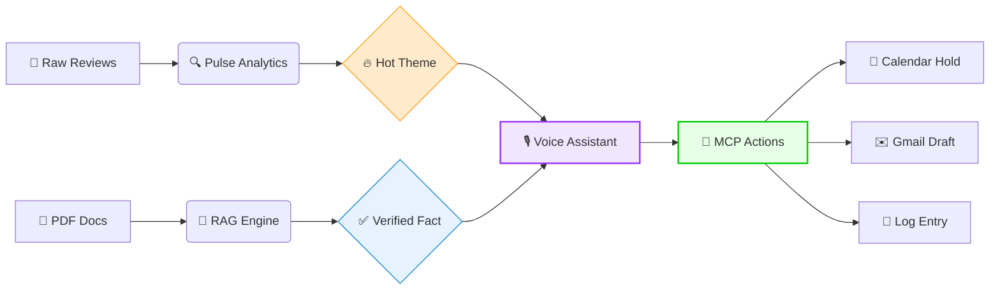

# 🛡️ Investor Ops & Intelligence Suite
### *Bridging Customer Feedback and Operational Appointment Workflows*

[](https://github.com/nish1502/investor-ops-intelligence-suite)
[](https://github.com/nish1502/investor-ops-intelligence-suite)
[](https://github.com/nish1502/investor-ops-intelligence-suite)

---

## 🎯 Overview

Fintech product teams and frontline support agents often operate in information silos. While product analysts monitor user feedback trends, client-facing advisors rarely have access to that live context before dial-in. This gap leads to operational inefficiencies and reactive problem-solving.

The **Investor Ops Intelligence Suite** bridges this gap by connecting live user analytics directly to appointment setup. By syncing **Sentiment Analytics**, **High-Precision Knowledge Search**, and an **Orchestrated Voice Agent**, the system automatically populates advisor briefings with actionable client context before the call ever begins.

---

## 🗺️ Workflow Architecture

A visual look at how data flows from incoming feedback to final automated operational actions:



---

## 🔄 Operational Workflow Flow

Data moves across connected workflows to reduce operational delays:

1.  **Data Ingestion**: Aggregates customer reviews and redacts sensitive PII using deterministic logic.
2.  **Trend Identification**: Evaluates feedback clusters to define the current active alert theme.
3.  **Context Awareness**: The **Voice Agent** adapts to this runtime state, injecting the active trend context into advisor conversations.
4.  **Workflow Automation**: Upon user confirmation, the orchestrator triggers operational workflows via MCP: generating tentative calendar events, logging audit trails, and drafting pre-briefs.
5.  **Advisor Handoff**: The frontline agent opens their inbox to find a prepopulated **Gmail Draft** with the exact client and market details needed for the call.

---

## 🌐 Active Interfaces
You can interact with the live endpoints of the platform here:

*   **🖥️ Unified Dashboard**: [https://investor-ops-intelligence-suite.vercel.app](https://investor-ops-intelligence-suite.vercel.app) 
*   **🧠 Knowledge API**: [https://m1-rag-faq.onrender.com](https://m1-rag-faq.onrender.com)
*   **🎙️ Scheduling Hub**: [https://m3-orchestrator.onrender.com](https://m3-orchestrator.onrender.com)

---

## 🏗️ System Pillars

### 🧬 Pillar 1: High-Precision Knowledge (RAG)
*Retrieves factual answers anchored strictly within authorized institutional PDFs.*
- **Operational Bottleneck**: Advisors lose time manually sourcing complex fee schemas hidden in PDFs.
- **The Fix**: A retrieval system enforcing strict metadata pre-filtering before vector searches, preventing cross-document hallucination errors.

### 📈 Pillar 2: The Intel Engine (Pulse)
*Transforms chaotic qualitative datasets into structured tracking alerts.*
- **Operational Bottleneck**: Manually quantifying thousands of qualitative app reviews creates bottlenecks.
- **The Fix**: A periodic analytics backend summarizing trending metrics and caching the summary artifact for low-latency cross-system reading.

### 🤖 Pillar 3: Orchestrated Actions (Scheduler)
*Utilizes event handlers to synchronize conversational state with workplace tools.*
- **Operational Bottleneck**: Confirmed bookings require repetitive manual admin setup across systems.
- **The Fix**: An intent-driven handler utilizing the **Model Context Protocol (MCP)** to trigger calendar, logging, and messaging workflows automatically.

---

## ⚙️ Technical Rationale
Design decisions tied directly to fintech stability and reliability:

*   **Why Enforce Metadata Constraints?** 
    Semantic similarity alone can inadvertently pull from adjacent funds. Filtering strictly by source ID first guarantees data integrity.
*   **Why Utilize FastMCP Integration?**
    Standardizing tool definitions speeds up development cycle-time and decreases maintenance overhead compared to bespoke client SDK wrapping.
*   **Why Implement Draft-Only Automation (HITL)?**
    Fully autonomous external communication creates compliance risk. Staging drafts ensures a **Human-In-The-Loop** reviews output before submission.

---

## 🛡️ Reliability & Safety Suitability
Evaluated behavior constraints verified through standardized checks:

| Category | Logic & Handling | Observed Reliability |
| :--- | :--- | :--- |
| **Source Fidelity** | Citation Anchoring. | Consistently maintains faithfulness to provided links in testing. |
| **Compliance** | Prompt Refusal Hooks. | Evaluated successfully to decline investment-buying advice triggers. |
| **Structural Fit** | Format Sanitizers. | Ensures predictable, well-formed response schemas every time. |

---

## 🛠️ Technology Stack
- **Frameworks**: Python 3.10, FastAPI, React, Next.js.
- **Databases**: PostgreSQL (pgvector), Cached JSON artifacts.
- **Intelligence**: Groq (Llama 3) chosen for low-latency inference response times.
- **Protocols**: Model Context Protocol (MCP) bridging Google Workspace workflows.

---

## 📂 Repository Map
```text
├── dashboard/                   # Operational control plane
├── indmoney-pulse/              # The analysis & redact layer (M2)
├── mf-rag-faq-indmoney/         # Retrieval & Search layer (M1)
├── multi-agent-appointment.../  # Automated workflow engine (M3)
├── docs/                        # Architecture & Specs
├── SOURCES.md                   # Approved URL Manifests
└── EVALS.md                     # Reliability validation report
```

---

## 🚀 System Launch
1. **Clone**: `git clone https://github.com/nish1502/investor-ops-intelligence-suite.git`
2. **Credentials**: Define security tokens in the local `.env` files.
3. **Backends**: Run FastAPI instance commands stored within M1 and M3 subdirectories.
4. **Interface**: Navigate to `/dashboard` and execute `npm install && npm run dev`.


