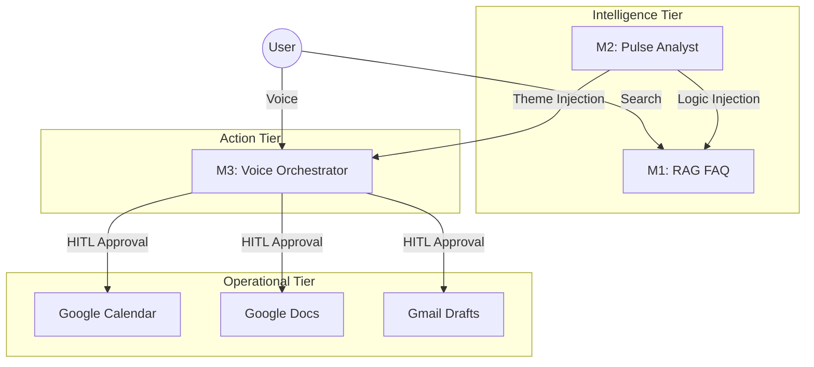

# Technical Architecture: Investor Ops & Intelligence Suite

The suite is designed as a modular, service-oriented ecosystem where independent intelligence modules (M1, M2, M3) communicate through a unified data layer.

## 🏗️ Core Components

### 1. Smart-Sync Knowledge Base (M1 + M2)
- **Engine**: RAG (Retrieval-Augmented Generation)
- **Database**: Supabase / PostgreSQL with `pgvector`
- **Retrieval Logic**: Two-stage strategy:
  1. Metadata filtering by fund name (High Precision).
  2. Semantic vector search (High Recall fallback).
- **Integration**: Dynamically appends fee logic reasoning from M2 to factual fund data from M1.

### 2. Theme-Aware Agent Logic (M2 + M3)
- **Intelligence Flow**: The Weekly Pulse (M2) analyzes thousands of customer reviews to identify top friction points (e.g., "Payment Failures").
- **State Synchronization**: This "Top Theme" is exposed via a JSON endpoint and ingested by the M3 Voice Agent during initialization.
- **Result**: Proactive greetings that mention current platform trends.

### 3. Human-in-the-Loop (HITL) Workflow
- **Protocol**: Model Context Protocol (MCP) actions.
- **Workflow**:
  - Voice Call ➔ Metadata Extraction (Date, Objective).
  - Orchestrator ➔ Approval Check ➔ Gmail/Calendar/Docs updates.
  - Context Injection ➔ M2 Market Context is injected into the advisor's email draft.

## 🔄 Data Pipeline Diagram

## 📈 Product Impact & Strategic Value

| Feature | Strategic Rationale | Business Metric Impact |
| :--- | :--- | :--- |
| **Theme-Aware Greeting** | Proactive service reduces "Time to Resolution." | ↓ Support Ticket Volume |
| **Market Context Injection**| Briefed advisors lead to higher quality meetings. | ↑ Meeting Conversion Rate |
| **Smart-Sync Search** | Transparent fee logic builds investor trust. | ↑ Customer Retention (LTV) |
| **Two-Stage Retrieval** | Zero-hallucination policy ensures compliance. | ↓ Regulatory Risk |
